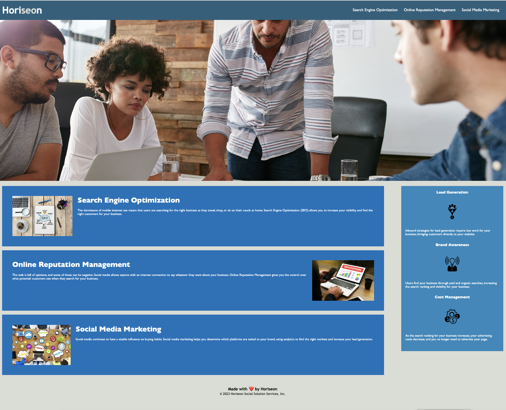

# first-refactoring

## Description

The goal of this project was to refactor code of an existing online marketing website. The changes to the code are as follows:

-- The non-semantic elements are replaced with semantic elements in order to make the site more accessible.
-- various sections of the website are organized and grouped to offer more clarity.
-- Alt texts are added to images and icons.
-- A broken link in the home page header is fixed.
-- CSS selectors are replaced to align better with the specific HTML sections.
-- Redundant CSS selectors are combined/removed.
-- indented HTML code to offer more clarity and organization.

## Installation

N/A

## Usage

This is an online marketing agency website. It promotes the advantages and benefits of online Search Engine Optimization (SEO). It informs clients of the importance of managing and improving the digital presence.

## Credits

Horiseon Social Solution Services, Inc.

## License

This project uses the MIT license.

## Badges

(https://img.shields.io/badge/made_with-HTML_CSS-blue)

## Features

Images contain alt text.

Code uses semantic elements and is organized using using easy to follow indentation.
